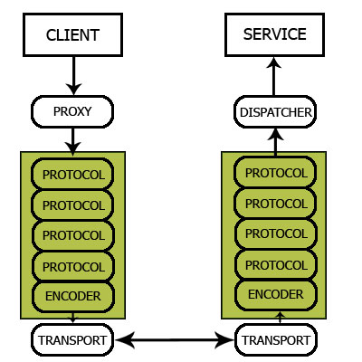
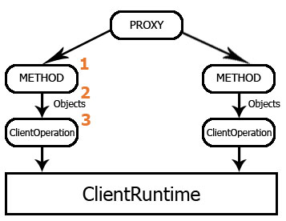
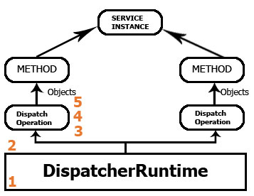

# WCF Extensibility: Parameter Inspectors

## Introduction

The WCF platform allows for great extensibility by allowing you to plugin any number of extensions at various points in the WCF pipeline. These points, aptly named extensibility points, can be found at predefined locations in the various layers that make up WCF.

This article focuses on one of the extension points in particular, namely parameter inspectors. Injecting a Parameter Inspector in the WCF pipeline at the client or service side will allow you to check, modify or reject (in short validate) any of the parameters that are going to be sent to the service or are received at the service end.

But first a short word on the WCF pipeline...

## The WCF Pipeline

The binding controls what happens on the wire for the endpoints it is attached to. Basically a binding consists out of an ordered collection of channels. You can define a custom binding by combining a number of BindingElement objects into an object of type BindingElementCollection. This collection is examined (traversed) by the WCF runtime in order to create a channel stack. Each binding element winds up being an object in the channel stack. A binding can consists out of the following type of binding elements:

- Transaction
- Reliability
- Security
- **Encoding**
- **Transport**

The above list represents the order in which the elements should be added to the BindingElementCollection. The last two elements are marked in bold, because they are the only two that are required for a custom (or predefined) binding to work.

They are required because it is the channel stack's responsibility to transform a WCF message object into a stream of bytes and vica versa. And for that is must be able to encode the message into something suitable such as text, binary or MTOM encoding (**Encoding**) and transporting it over the wire (**Transport**). Lets ponder the following image.

**Figure 1** - WCF Pipeline



Although you can extend the channel stack to your desire, the Parameter Inspection extensibility point is not located here. On top of the channel stack or layer if you will sits another layer called the Service Model layer. Service Model, that should have a familiar ring to it.

What do you see sitting on top of the channel stack on the client side? The Proxy! And on the service side it's the Dispatcher. These two objects provide you with a set of extensibility points in which you can plugin your own extensions. The functionality of these extensions can vary greatly and are only limited to your imagination.

## The Proxy

The Proxy's main responsibility is to convert a bunch of .NET objects into a WCF message object. This message object will then be passed through the various elements in the Channel Stack before being encoded and transported over the wire.

However before the message object is handed of to the Channel Stack WCF allows you to plugin custom extensions in **three** extensibility points, namely:

1. Parameter Inspection
2. Message Formatting
3. Message Inspection

Let's again illustrate this with an image, as it says more than a thousand words.

**Figure 2** - WCF Proxy Pipeline



Each exposed operation on the service is represented by a ClientOperation object and they all share one ClientRuntime object during the proxy's lifetime. The numbered items in the image correspond to the previously mentioned extensibility points.

The first extensibility point will allow you to inspect the parameters being sent to the service, modify or reject them before they sent over the wire. This type of validation will save you an unnessary roundtrip to the service. It is advisable to have the service side also validate the incoming parameters, since you can't rely on all of the service's clients to do so. Just as an ASP.NET application never trust the data being received.

The remaining extensibility points Message Formatting and Message Inspection allow you to respectively customize the serialization and the generated WCF message object. After the last extensibility point the WCF message object is handed off to the channel stack for further processing and finally transportation accross the wire.

## The Dispatcher

As you might guess the extensibility points on the service side are almost identical though they are executed in reverse order and WCF provides you with an additional two points. That gives a total of **five** extensibility points, namely:

1. Message Inspection
2. **Operation Selector**
3. Message Formatting
4. Parameter Inspection
5. **Operation Invoker**

The ones being marked in bold are only available on the service side. The names of these new extensibility points pretty much indicate their nature. The Operation Selector gives you control over which operation should be invoked. The Operation Invoker is the last in line and passes the parameters (modified or not) to the targetted method. Plugging in a custom Operation Invoker in the Dispatcher pipeline gives you more granular control how the targetted method will be called.

The following figure shows the flow:

**Figure 3** - WCF Dispatcher Pipeline



As you can see the way the service side operates is pretty simular, but instead of one ClientRuntime and several ClientOperation objects you have one DispatcherRuntime object and one DispatchOperation object per exposed operation on the service.

The Channel Stack receives a stream of bytes, processes it and converts it back into a WCF message object which it then hands off to the DispatcherRuntime object. First up is the Message Inspection objects which allows you to examine and if necessary alter the incoming WCF message object.

The Operation Selector is responsible for determining which operation should be invoked. If you don't insert a custom Operation Selector then by default the invoked operation is matched with the name of the called method.

If you use Message Formatting be sure to implement it at the client and service side. If the service receives a differently formatted message that it doesn't know how to deserialize then it won't be able to process it and vica versa.

When the message has been inspected, the operation selected and the message properly deserialized into .NET objects the parameters can finally be inspected before the operation is invoked. Invoking the operation is the last part in the Dispatcher pipeline and last opportunity for you to insert a custom extension.

## Parameter Inspector

As mentioned earlier a Parameter inspector gives you the ability to inspect outgoing (client) and incoming (service) parameters. Based on the values of said parameters you might opt to do nothing, modify them or reject them altogether.

Although you could certainly build this validation directly into the methods of the service types and the proxy it only makes this code more harder to maintain and more prone to bugs. It is cleaner to separate this validation code. This gives you greater control and reusability. A Parameter Inspector can be used for one of more services.

In order to implement a Parameter Inspector you need to design a class which implements the [IParameterInspector](http://msdn.microsoft.com/en-us/library/system.servicemodel.dispatcher.iparameterinspector.aspx) interface.

**Listing 1** - IParameterInspector Interface

```csharp
#region IParameterInspector Members

public void AfterCall(string operationName, object[] outputs, object returnValue, object correlationState)
{ }

public object BeforeCall(string operationName, object[] inputs)
{ }

#endregion
```

Luckily the interface only contains two methods you need to implement. Depending on the wanted functionality of the inspector it might suffice to only implement one of these methods. Both methods receive a parameter which is an array of objects (object\[\]). This array contains the parameters that are subject to inspection.

There is a subtle difference you need to take note of however. Depending on which side you implement the Parameter Inspector it will react differently. On the client side the BeforeCall(...) method is invoked just before the operation call (and the parameters) is serialized into a WCF message object (= the request). The AfterCall(...) method is invoked just after the reply from the service has been received and deserialized into a WCF message object.

On the service side the BeforeCall(...) is invoked after the request has been received and deserialized in a WCF message object. The AfterCall(...) method is invoked just after the operation has been invoked, but just before the response is to be serialized.

**Remark**: The BeforeCall(...) and AfterCall(..) methods both contain a string parameter called operationName. However this refers to the name in the contract and not the name of the method called by proxy on the client side or by the dispatcher on the service side. It contains the name specified by the OperationContract attribute. If the OperationContract doesn't include a named parameter Name to name the method, the original method name will be used.

## Implementing The Parameter Inspector

As you can see in Listing 1 the BeforeCall(...) method returns an object of type System.Object. This return value can be anything you want, it doesn't have to be related to the actual validation of the parameters that occurs in the implementation of this method. The returned value is maintained by the WCF Runtime and passed back into the AfterCall(...) method as the correlationState parameter. This enables you to correlate the BeforeCall(...) and AfterCall(...) invocations for whatever business logic that might require this.

From the preceding paragraph you can deduce that the return value from the BeforeCall(...) method won't modify the parameters or cause them to be rejected. If you want to modify the parameters then just alter the values of the objects in the inputs object array. If you want to reject the operation invocation altogether then you need to throw a new FaultException. Pass any type needed into the generic FaultException to pass along more details of the exception. Ofcourse you can just throw a non-generic FaultException too.

**Listing 2** - IParameterInspector Implementation

```csharp
public class MyParameterInspector : IParameterInspector
{
  #region IParameterInspector Members

  public void AfterCall(string operationName, object[] outputs, object returnValue, object correlationState)
  {
    Guid result = (Guid) correlationState;
    // ...
  }

  public object BeforeCall(string operationName, object[] inputs)
  {
    string parameter1 = inputs[0] as string;
    if (parameter1 != "Hello, World!")
    {
      return new FaultException("The value of your parameter is incorrect.");
    }
    return Guid.NewGuid();
  }

  #endregion
}
```

## Injecting The Parameter Inspector

Now that you have your Parameter Inspector defined you need to tell WCF to actually use it. This differs on the client and service side. On the client side, if I am to believe various sources, you can only inject a Parameter Inspector imperatively instead of declaratively using a configuration file or attributes.

**Listing 3** - Injecting a Parameter Inspector on the Client

```csharp
SimpleServiceClient proxy = new SimpleServiceClient();
proxy.Endpoint.Contract.Operations[0].Behaviors.Add(new MyParameterInspector());
```

For the service side you need to declare an attribute that implements one (or more of) the following interfaces:

1. [IOperationBehavior](http://msdn.microsoft.com/en-us/library/system.servicemodel.description.ioperationbehavior.aspx)
2. [IEndpointBehavior](http://msdn.microsoft.com/en-us/library/system.servicemodel.description.iendpointbehavior.aspx)
3. [IServiceBehavior](http://msdn.microsoft.com/en-us/library/system.servicemodel.description.iservicebehavior.aspx)

This article only focuses on the IOperationBehavior attribute. Take a look at [MSDN](http://www.msdn.com/) for the other posibilities.

And to quote MSDN the IOperationBehavior interface requires you to implement the following four methods:

- **AddBindingParameters**: Pass custom data at runtime to enable bindings to support custom behavior
- **ApplyClientBehavior**: Modify, examine or insert extensions to a client dispatcher in a client application
- **ApplyDispatchBehavior**: Modify, examine or insert extensions to operation-wide execution in a service application
- **Validate**: Confirm that a OperationDescription meets specific requirements. This can be used to ensure that an operation has a certain configuration setting enabled, supports a particular feature and other requirements.

You can disregard the AddBindingParameters, ApplyClientBehavior and Validate methods. The only method of interest here is the ApplyDispatchBehavior method. In it you have to inject the custom Parameter Inspector into the WCF Dispatcher pipeline for a particular method.

**Listing 4** - Injecting a Parameter Inspector on the Service

```csharp
public class MyInspectorAttribute : Attribute, IOperationBehavior
{
  public void ApplyDispatchBehavior(OperationDescription operationDescription, DispatchOperation dispatchOperation)
  {
    MyParameterInspector inspector = new MyParameterInspector();
    dispatchOperation.ParameterInspectors.Add(inspector);
  }

  public void ApplyClientBehavior(OperationDescription operationDescription, ClientOperation clientOperation)
  { }

  public void AddBindingParameters(OperationDescription operationDescription, BindingParameterCollection bindingParameters)
  { }

  public void Validate(OperationDescription operationDescription)
  { }
}
```

The only thing that remains is to decorate one or more of the exposed operation on the service contract with the newly created MyInspectorAttribute attribute.

**Listing 5** - Applying the MyInspector Attribute

```csharp
[OperationContract]
[MyInspectorAttribute]
void SayHello(string parameter);
```

Voila, now you are all set to inject your own parameter inspectors at your heart's desire.

## Summary

Though you might not directly need to extend the functionality of WCF it's nice to know that it's possible and extremely flexible. The scenario for extending WCF's functionality might come in handy when you need to apply instrumentation. E.g.: Parameter and Message Inspectors might come in handy for logging every incoming and outgoing parameter and message.

Also be sure to check out the possibilities of the Enterprise Library. Specifically the integration between Validation Application Block and the Windows Communication Foundation.

**Remark**: There is no source code for this article. At the time of writing I did not have Visual Studio installed on my laptop and my secondary laptop was refusing to function for reasons unknown. The amount of source code for this article was thus deliberately kept short.
